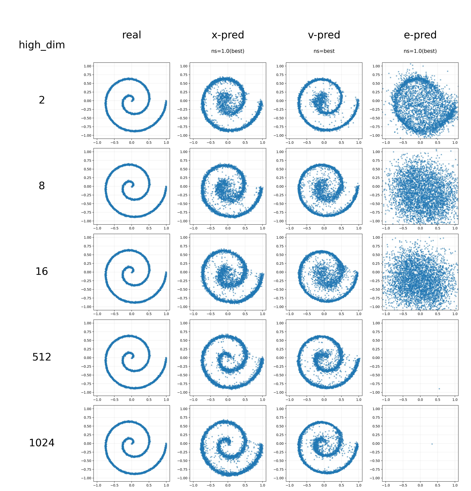
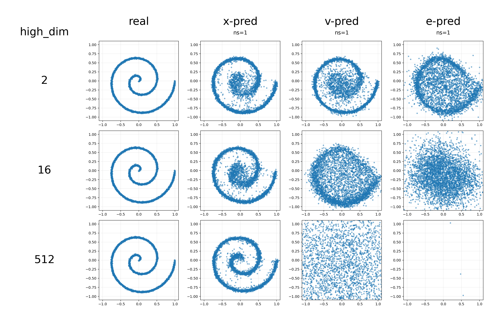

# Toy: x/e/v-pred on 2D Data with a 5-Layer ReLU MLP

This project is a small experimental framework built around a 5-layer ReLU MLP for comparing `x-pred`, `e-pred`, and `v-pred` under the same `v-loss` training objective.

## Findings

For 2D spiral-distributed data embedded in a high-dimensional space:
+ `x-pred` fits well while simply keeping **`noise_scale=1.0`**. 
+ `v-pred` requires more careful `noise_scale` design; the exact best formula is still unknown, but keeping **`SNR=1.0`** yields a `noise_scale` in the same order of magnitude as the best one. Its best performance is slightly worse than `x-pred`, but it can still fit the data well. We also provide a reference list in [best_ns.md](best_ns.md).
+ `e-pred` performs poorly under all tested `noise_scale` settings.

You can reproduce the figures above with:

```bash
python train.py \
  --num_points 4096 \
  --high_dim 2,8,16,512,1024 \
  --pred_types x,v,e \
  --epochs 2000 \
  --batch_size 1024 \
  --sample_steps 100 \
  --sample_method heun \
  --noise_std 0.01 \
  --noise_scale best
```

If **`noise_scale=1.0`** is used for all dimensions, only `x-pred` continues to work well across the full range.



```bash
python train.py \
  --num_points 4096 \
  --high_dim 2,16,512 \
  --pred_types x,v,e \
  --epochs 2000 \
  --batch_size 1024 \
  --sample_steps 100 \
  --sample_method heun \
  --noise_std 0.01 \
  --noise_scale 1.0
```


## Pipeline

1. Generate 2D data. The current shapes are `spiral` and `line`.
2. Project the 2D points into a higher-dimensional space with a fixed matrix `P`(`P^TP=I`), giving `X = x P^T`.
3. Train a time-conditioned MLP in high-dimensional space to predict `x`, `e`, or `v`.
4. Sample from Gaussian noise using either Euler or Heun updates.
5. Map generated samples back to 2D and save plots plus run metadata.

## Project Layout

- `train.py`: entry point; handles argument parsing, data preparation, experiment orchestration, and output saving
- `diffusion.py`: training target construction, `pred -> v` conversion, and sampling
- `model.py`: time-conditioned MLP
- `data.py`: 2D data generation and projection-matrix construction
- `plot.py`: scatter plots, loss curves, and comparison grid plotting
- `utils.py`: utility helpers for parsing, seeding, and output directory naming

## Main Options

- `--shape`: `spiral` or `line`
- `--pred_types`: comma-separated prediction types chosen from `x,e,v`
- `--high_dim`: comma-separated projection dimensions, for example `2,4,8`
- `--projection_mode`: `random_orthonormal` or `identity`
- `--noise_scale`: supports `auto`, `best`, a single numeric value, a numeric list, `e`, or `var`
- `--sample_method`: `euler` or `heun`
- `--width`: MLP hidden width, default `256`
- `--out_dir`: output directory; if empty, a default directory name is generated automatically

`--noise_scale` modes:

- `auto`: `v-pred` uses the `var`-based estimated noise scale, while `x-pred` and `e-pred` both use `1.0`
- `best`: `x-pred` and `e-pred` behave the same as `auto`, while `v-pred` uses a hard-coded lookup table derived from `best_ns.md`
- `e`: `noise_scale = sqrt(E / high_dim)`, where `E = mean(||X||^2)`
- `var`: `noise_scale = sqrt(var_total / high_dim)`, where `var_total` is the sum of per-dimension variances
- numeric value or numeric list: use the provided fixed noise scale directly

## Visualization

- The first column of the comparison plot is always the real 2D data, labeled `real`
- Each row corresponds to one `high_dim`
- The remaining columns correspond to different `pred_type + noise_scale` settings
- Each column title includes a noise-scale label or value below it

To keep the comparison grid readable, the script limits the sweep dimensionality across:

- `high_dim`
- `pred_types`
- `noise_scale`

At most three of these axes may vary at once. If the combination space is larger, the script raises an error.

## Run Example

```bash
python train.py \
  --shape spiral \
  --num_points 4096 \
  --high_dim 2,4,8 \
  --pred_types x,v \
  --noise_scale auto \
  --epochs 4000 \
  --batch_size 256 \
  --sample_steps 100 \
  --sample_method heun
```

## Outputs

- `spiral_2d.png`: the original 2D data
- `spiral_recovered_from_highdim.png`: the reconstruction `P^T(Px)`
- `compare_real_vs_generated.png`: side-by-side comparison of generated samples across settings
- `loss_curves.png`: full loss curves when `epochs <= 200`
- `loss_curves_first200.png`: first 200 epochs of the loss curves when `epochs > 200`
- `loss_curves_last10.png`: last 10 epochs of the loss curves when `epochs > 200`
- `run_meta.pt`: run arguments, projection error, per-run metadata, and final losses

## Notes

- The default output directory format is `./out/{pred_types}_{high_dim}{optional_suffixes}`
- `projection_mode=identity` only supports `high_dim=2`
- If `--noise_scale=best` is used with `v-pred`, every `high_dim` must exist in the hard-coded table derived from `best_ns.md`, otherwise the script raises an error
